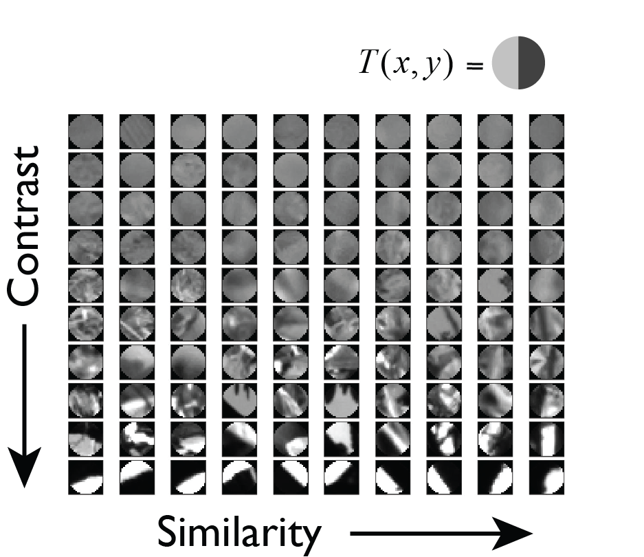

# Occlusion Detect
Bayes optimal detection of visual signals in natural backgrounds. 
<!---
<> 
---!>

This project studies the detection of visual objects under noisy background conditions.

We are studying occlusion. That is, objects that occlude the background.

Here is an example of an occluding object in background noise.

